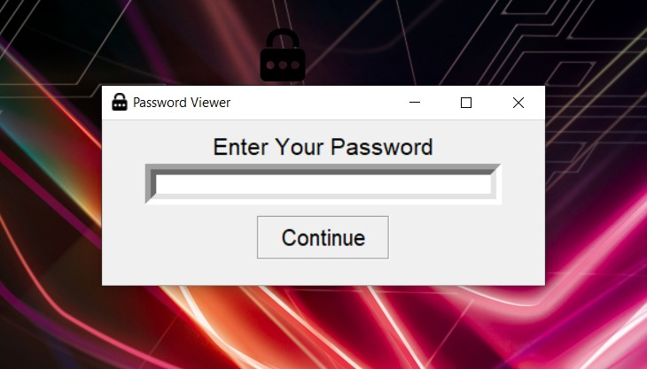
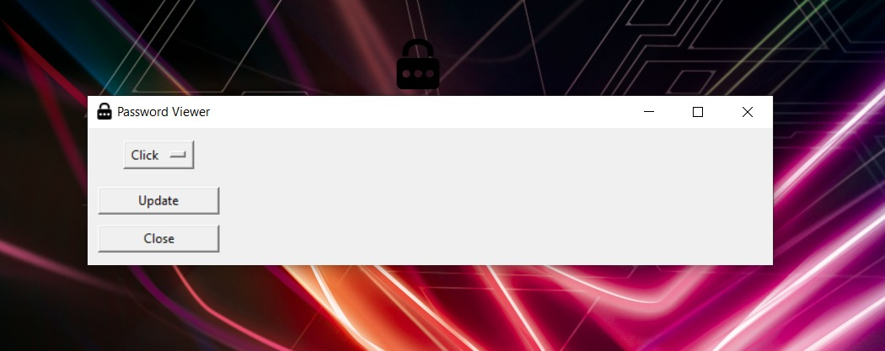
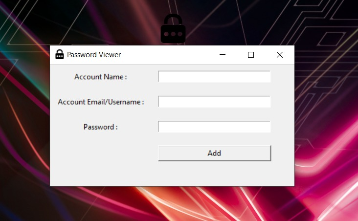

# Password_Saver_With_Login-Python

This Repository is Very useful to those people who are having more and more accounts(gmail,yahoo,facebook,etc).
I build this application using tkinter (Python GUI) without console window while opening the app. 
This Application Helps to add their email and password to their Computer.
Sometimes google cant save passwords
There is an update option in the application , in there you can save accounts and view your account any time.
This application is protected by passwords so no one can take your account from your computer.

# Application Images

   

# Open tkinter application Without Windows Console
see my video == https://youtu.be/LsBc1S5k05o
